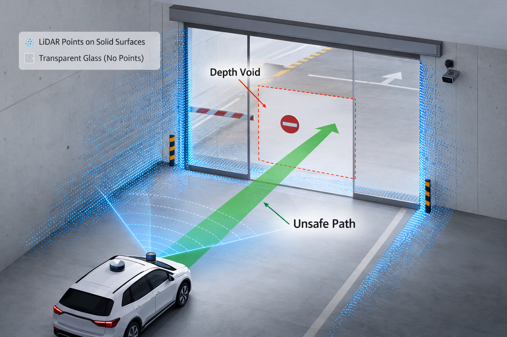

# 1.4.1 Part A — Glass-Induced Unsafe Scenarios (A1, A2)

Part A studies two glass-induced corner cases that are jointly representative and technically non-redundant. They originate from the same physical source, namely the decoupling between appearance and geometry around reflective or transparent surfaces, but they fail in opposite directions at the decision layer. A1 is framed as **False Positive Trajectory Commitment under Phantom Obstacles**: a non-physical target is promoted into the motion stack and triggers safety-critical control interventions. A2 is a **false free-space commitment** problem: a physical barrier is not preserved as non-traversable under depth uncertainty and is crossed by a nominal path. The pair directly tests whether the stack preserves uncertainty before committing trajectory-level decisions.

## A1: Reflective Facade Ghost Vehicle and Unwarranted Braking/Evasion

A1 is instantiated on an urban corridor with a large reflective facade adjacent to the roadway. A real vehicle in an adjacent or opposite stream is reflected by the facade and appears in the ego camera view as a plausible forward threat. The immediate technical difficulty is that the reflected target can remain visually coherent across frames, so the camera branch provides a high-confidence object hypothesis even though no physical obstacle occupies the ego lane. As illustrated in Fig. 1, the conflict emerges when the reflected visual target projects into the ego driving corridor while geometry-supporting modalities remain inconsistent.

*Figure 1. A1 Ghost Vehicle (false-positive obstacle) scenario geometry. A reflective facade creates a visually plausible phantom vehicle hypothesis in the ego path. The key safety condition is cross-modal inconsistency: camera evidence remains strong while LiDAR/radar support is sparse, unstable, or multipath-contaminated, which can trigger false positive trajectory commitment if contradiction is not explicitly penalized [4], [5], [8].*

The failure chain starts in cross-modal observation consistency. Reflection-focused studies show that LiDAR around reflective planes may alternate between sparse returns, surface returns, and geometrically inconsistent support [4], [5]. Automotive radar under multipath can also generate ambiguous weak positives instead of a clean veto [8]. Consequently, the multi-sensor evidence profile in A1 rarely manifests as a clean "camera positive vs. geometric negative" dichotomy; rather, it presents as dominant visual hypotheses reinforced by ambiguous auxiliary signals.

At fusion and tracking, the critical design choice is whether contradiction is explicitly penalized. Let $\mathcal{M}=\{\mathrm{cam},\mathrm{lid},\mathrm{rad}\}$ denote sensor modalities, and let $S_{\mathrm{track}}^{(i)}(t)$ denote the confidence score of track $i$ at time $t$. A permissive baseline typically uses additive evidence aggregation:

$$
S_{\mathrm{track}}^{(i)}(t)=\sum_{m\in\mathcal{M}} w_m\, p\!\left(z_t^{(m)}\mid x_t^{(i)}\right),
$$

with promotion to a planning obstacle when $S_{\mathrm{track}}^{(i)}(t)\ge \tau_{\mathrm{conf}}$.

Under this baseline, a high camera likelihood $p(z_t^{(\mathrm{cam})}\mid x)$ combined with nonzero radar multipath likelihood $p(z_t^{(\mathrm{rad})}\mid x)>0$ can push the score over threshold even when LiDAR support is unstable. A contradiction-aware formulation introduces an explicit cross-modal disagreement penalty:

$$
\tilde{S}_{\mathrm{track}}^{(i)}(t)=
\sum_{m\in\mathcal{M}} w_m\, p\!\left(z_t^{(m)}\mid x_t^{(i)}\right)
-\lambda\,\mathrm{Var}_{m\in\mathcal{M}}\!\left[p\!\left(z_t^{(m)}\mid x_t^{(i)}\right)\right].
$$

When the variance term is omitted (or $\lambda$ is effectively near zero), repeated camera dominance can produce persistent phantom tracks. Once promoted, prediction treats the track as physically real, TTC decreases in the internal risk model, and planning may trigger high-jerk evasive maneuvers or unnecessary hard deceleration.

This is where camera-only and multi-sensor stacks diverge in mechanism. Camera-only fails through semantic ambiguity without geometric veto. Multi-sensor stacks fail when ambiguous auxiliary responses are treated as confirmatory instead of contradictory. The decisive variable is therefore not sensor count, but contradiction arbitration at the fusion-to-planning interface [3].

From a safety standpoint, A1 is a control-authority escalation failure. The planner acts on uncertain evidence as if it were confirmed, yielding unnecessary high-jerk evasive maneuvers and increased rear-end or side-conflict exposure. This failure class aligns with external safety framing on false activation risk in AEB-related evaluation contexts [1], while also fitting the known difficulty of reflective environments in controlled test design [2]. In summary, unless fusion explicitly penalizes cross-modal contradiction, both camera-only and multi-sensor architectures remain failure-prone in A1: the former fails due to missing geometric validation, while the latter fails when weak multipath/reflective traces are over-trusted as corroboration.

## A2: Transparent Barrier and Free-Space Over-Commitment

A2 is instantiated at an underground parking garage exit secured by a closed transparent glass door. This specific geometry naturally combines ramp structure and illumination transition from dim interior to bright exterior, which reinforces visual traversability priors in camera perception. The camera branch therefore observes a continuous outdoor scene through the glass, while depth channels can become sparse or unstable exactly at the true barrier boundary [6], [7]. Figure 2 shows the resulting semantic deception where a physically blocked region is interpreted as a passable corridor.

*Figure 2. A2 Transparent Barrier (false-negative free-space) scenario geometry. A transparent barrier preserves visual background cues while degrading depth certainty near the boundary. If occupancy evidence is aggressively collapsed from unknown to free, the planner receives a spurious traversable corridor and may commit barrier-intersecting trajectories [6], [7].*

The dominant failure point is occupancy/traversability update, not prediction. Let each grid cell $c$ be modeled in an evidential framework with frame of discernment $\Omega=\{O,F\}$, where $O$ and $F$ denote occupied and free. The mass function satisfies:

$$
m_c(O)+m_c(F)+m_c(\Omega)=1,
$$

where $m_c(\Omega)$ is the explicit unknown state induced by depth void. The critical safety requirement is to preserve $m_c(\Omega)$ when near-field depth evidence is insufficient. A2 fails when the stack prematurely collapses evidential uncertainty into deterministic free-space, i.e., it applies a forced update of the form

$$
m_c^{t+1}(F)=m_c^t(F)+\kappa\,m_c^t(\Omega),\quad
m_c^{t+1}(\Omega)=(1-\kappa)\,m_c^t(\Omega),
$$

with large $\kappa$ despite missing or unstable range support. The planner then receives a spurious traversable corridor and commits control actions that can intersect a transparent barrier.

The resulting error is structurally different from A1. A1 overreacts to non-physical obstacles; A2 underreacts to physical obstacles. Yet both share the same causal pattern: uncertainty is collapsed before contradiction is resolved.

Architecture comparison in A2 is again policy-dependent. Camera-only systems are vulnerable because semantic priors about doorways and open passages can dominate without robust range verification. Multi-sensor systems are vulnerable for a different reason: additional sensors do not help if the occupancy rule aggressively converts uncertainty into free-space. The same multi-sensor stack becomes substantially safer only when unknown mass is preserved near transparent boundaries and planning is prohibited from committing trajectories through unresolved cells.

Operationally, A2 has lower kinetic energy than A1 but higher exposure frequency in real access zones. The safety consequence is not limited to barrier contact; repeated stop-go hesitation and deadlock at entrances can also create secondary risk and traffic disruption. In summary, unless the system preserves evidential uncertainty instead of determinizing it, both camera-only and multi-sensor architectures remain failure-prone in A2: the former due to weak geometric validation, the latter due to aggressive uncertainty collapse in occupancy semantics.

## Cross-Scenario Technical Synthesis for Part A

The main result of Part A is that glass-induced corner failures are governed by **where uncertainty is collapsed**. In A1, collapse occurs at obstacle confirmation: ambiguous observations are determinized into phantom collision objects. In A2, collapse occurs at traversability assignment: evidential uncertainty is prematurely collapsed into deterministic free-space. This distinction maps to different control hazards and different mitigation levers.

For architecture-level conclusions, Part A supports a precise claim that directly answers the assignment criterion: both architecture classes can fail in A1 and A2 unless explicit contradiction arbitration is enforced. Camera-only fails through semantic ambiguity without geometric verification. Multi-sensor stacks fail when weak auxiliary evidence is over-trusted in A1 or when missing-depth uncertainty is aggressively folded into free-space in A2. Therefore, the strongest baseline-versus-mitigation comparison is not "single sensor vs many sensors," but "permissive commitment vs contradiction-aware commitment" across both architectures.

Sections 1.5 and 1.6 implement this synthesis with measurable criteria. Section 1.5 quantifies unsafe commitment through unified metrics (false braking, ghost persistence, barrier collision, unknown-to-free violations). Section 1.6 introduces two targeted policy changes: contradiction-aware obstacle promotion for A1 and conservative unknown-preserving traversability for A2.
